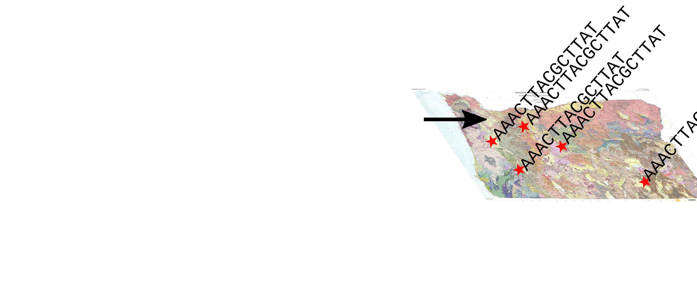
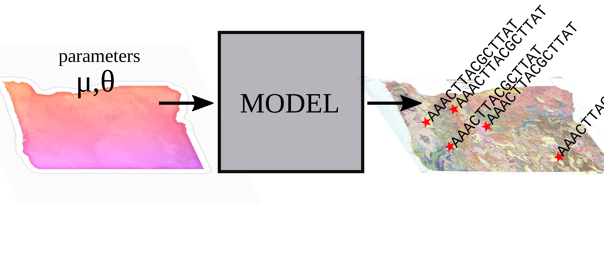
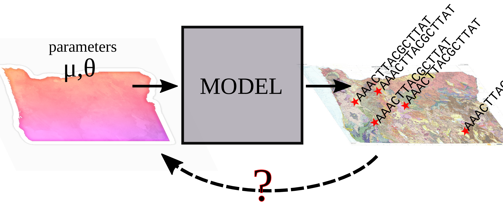
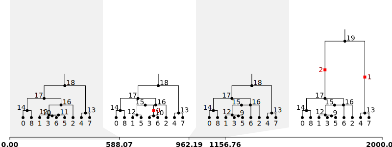
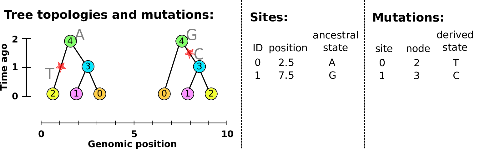
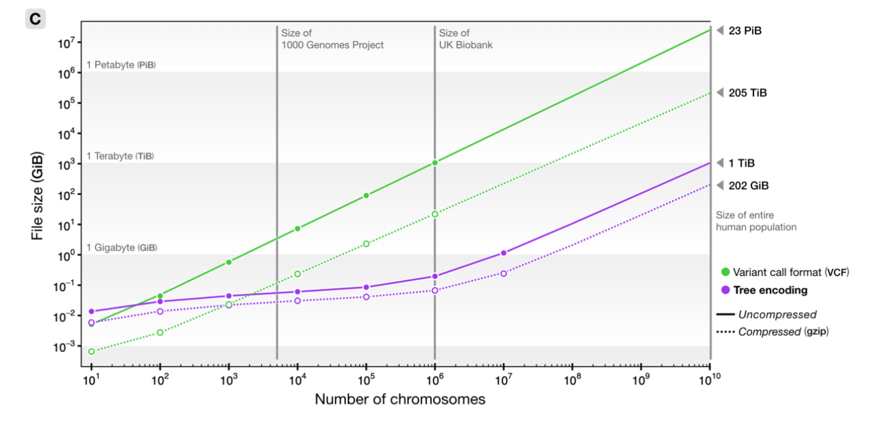
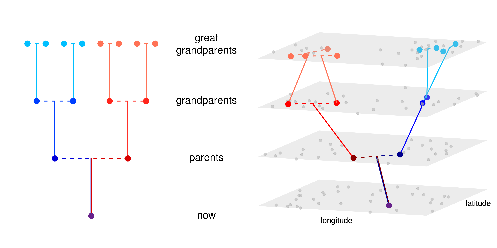
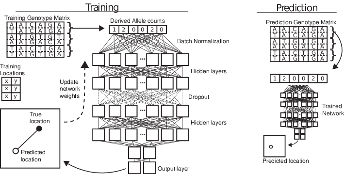
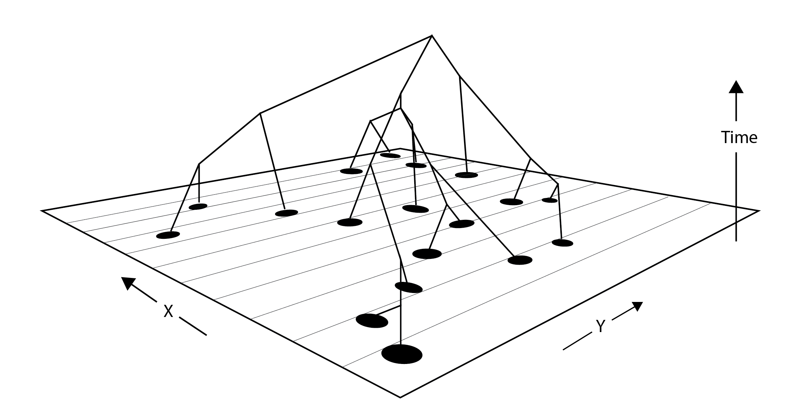
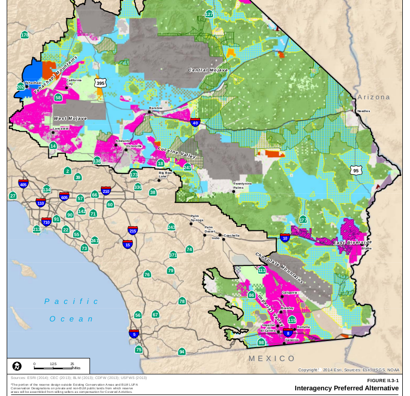

# Outline

## Outline of the talk

1. Genomes, and simulations
2. The tree sequence
3. Applications

*slides:* [github.com/petrelharp/umich-feb-2022](https://petrelharp.github.io/umich-feb-2022/umich-feb-2022.slides.html)

# Inference, with genomes

##

##

##

##

##

## Simulation-based inference

::: {.centered}
{width=60%}
:::

- bespoke confirmatory simulations
- optimization of one or two parameters
    <!-- *(if between-simulation noise is small)* -->
- Approximate Bayesian Computation (ABC)
- deep learning

# What do we need

##

1. Fast simulation of genomes

2. Fast computation of summary statistics

## Wish list:

::: {.smallish}

::: {.columns}
::::::: {.column}

Whole genomes,
thousands of samples, \
from millions of individuals.

**Demography:**

- life history 
- separate sexes
- selfing
- polyploidy
- species interactions

**Geography:**

- discrete populations
- continuous landscapes
- barriers

**History:**

- ancient samples
- range shifts

:::
::::::: {.column}

**Natural selection:**

- selective sweeps
- introgressing alleles
- background selection
- quantitative traits
- incompatibilities
- local adaptation

**Genomes:**

- recombination rate variation
- gene conversion
- infinite-sites mutation
- nucleotide models
- context-dependence
- mobile elements
- inversions
- copy number variation

:::
:::::::

:::

## Enter SLiM

::: {.columns}
::::::: {.column width=50%}

by Ben Haller and Philipp Messer

an individual-based, scriptable forwards simulator

:::: {.caption}

*Ben Haller*
::::

:::
::::::: {.column width=50%}

[messerlab.org/SLiM](https://messerlab.org/SLiM/)

:::
:::::::

##

::: {.smallish}

::: {.columns}
::::::: {.column}

- <s>Whole genomes,</s>*
- <s>thousands of samples, </s>
- <s>from millions of individuals.</s>*

**Demography:**

- <s>life history</s>
- <s>separate sexes</s>*
- <s>selfing</s>
- polyploidy*
- species interactions **(coming soon!)**

**Geography:**

- <s>discrete populations</s>
- <s>continuous landscapes</s>
- <s>barriers</s>*

**History:**

- <s>ancient samples</s>
- <s>range shifts</s>

:::
::::::: {.column}

**Natural selection:**

- <s>selective sweeps</s>
- <s>introgressing alleles</s>
- <s>background selection</s>
- <s>quantitative traits</s>*
- <s>incompatibilities</s>*
- <s>local adaptation</s>*

**Genomes:**

- <s>recombination rate variation</s>
- <s>gene conversion</s>
- <s>infinite-sites mutation</s>
- <s>nucleotide models</s>
- <s>context-dependence</s>*
- mobile elements*
- inversions*
- copy number variation

:::
:::::::

:::

## 

- <s>Whole genomes,</s>*

# Genomes and genealogies

## Genomes

> - are very big ($10^7$--$10^{12}$ nucleotides)
> - encode the basic *mechanisms* of life
> - reflect past *history* and *process*

. . .

## 

Your two copies of the genome
were inherited, noisily, from your two parents,

. . .

and from your four grandparents,

. . .

and your eight great-grandparents

. . .

and your sixteen great-great-grandparents

<!--

## Genealogical ancestors

In a well-mixed population of size $N$,

- A most recent common ancestor of *everyone* lived at $\approx \log_2 N$ generations ago.

- For humans: $\approx 500$ years; 
    but including geography and history,
    $\approx$ 2--3 thousand years
    (Chang ’99; Rohde, Olson & Chang ’04)

- *Everyone* alive $\approx 1.77 \log_2 N$ generations ago
    is either an ancestor of everyone or has left behind no descendants. (Chang ’99)

-->

## Meiosis & Recombination

::: {.columns}
::::::: {.column width=50%}

:::
::::::: {.column width=50%}

- You have two copies of each chromosome, 
  one from each parent.

- When you make a gamete, the copies *recombine*, at Poisson($\rho$) locations.

- *Mutations* appear at Poisson($\mu$) locations.

:::
::::::

## You and your great${}^{k-2}$-grand parents

The number of $k^\text{th}$ *genetic* ancestors
grows *linearly* with $k$.

::: {.centered}

:::

::: {.caption}
from [gcbias.org](https://gcbias.org/2013/11/11/how-does-your-number-of-genetic-ancestors-grow-back-over-time/)
:::

## 

::: {.centered}
{width=60%}
:::

::: {.caption}
from [gcbias.org](https://gcbias.org/2013/11/11/how-does-your-number-of-genetic-ancestors-grow-back-over-time/)
:::

## 

::: {.centered}
{width=60%}
:::

::: {.caption}
from [gcbias.org](https://gcbias.org/2013/11/11/how-does-your-number-of-genetic-ancestors-grow-back-over-time/)
:::

<!-- Tree sequences -->

# The tree sequence

## History is a sequence of trees

For a set of sampled chromosomes,
at each position along the genome there is a genealogical tree
that says how they are related.

. . .

----------------------

The **succinct tree sequence**

::: {.floatright}
is a way to succinctly describe this, er, sequence of trees

*and* the resulting genome sequences.

:::: {.caption}
[Kelleher, Etheridge, & McVean](http://journals.plos.org/ploscompbiol/article?id=10.1371/journal.pcbi.1004842) 
::::
:::

. . .

::: {.columns}
:::::: {.column width=50%}

{width=80%}

:::
:::::: {.column width=50%}

::: {.floatright}
{width=50%}

:::: {.caption}
jerome kelleher
::::

:::

:::
::::::

## Example: three samples; two trees; two variant sites

## Nodes and edges

Edges 

:   Who inherits from who.

    Records: interval (left, right); parent node; child node.

Nodes 

:   The ancestors those happen in.

    Records: time ago (of birth); ID (implicit).

-------------------

-------------------

-------------------

-------------------

-------------------

-------------------

-------------------

## Sites and mutations

Mutations

:   When state changes along the tree.

    Records: site it occured at; node it occurred in; derived state.

Sites 

:   Where mutations fall on the genome.

    Records: genomic position; ancestral (root) state; ID (implicit).

------------------

------------------

------------------

------------------

------------------

------------------

**The result:**
an encoding of the genomes *and* all the genealogical trees.

::: {.centered}

:::

# How's it work?

## File sizes

::: {.centered}
{width=90%}
:::

::: {.caption}
100Mb chromosomes;
from [Kelleher et al 2018, *Inferring whole-genome histories in large population datasets*](https://www.nature.com/articles/s41588-019-0483-y), Nature Genetics
:::

<!-- Estimated sizes of files required to store the genetic variation data for a
simulated human-like chromosome (100 megabases) for up to 10 billion haploid
(5 billion diploid) samples. Simulations were run for 10 1 up to 10 7 haplotypes
using msprime [Kelleher et al., 2016], and the sizes of the resulting files plotted
(points). -->

---------------

---------------

---------------

## For $N$ samples genotyped at $M$ sites

::: {.columns}
::::::: {.column width=50%}

*Genotype matrix*:

$N \times M$ things.

:::
::::::: {.column width=50%}

*Tree sequence:*

- $2N-2$ edges for the first tree
- $\sim 4$ edges per each of $T$ trees
- $M$ mutations

$O(N + T + M)$ things

:::
:::::::

{width=60%}

# Summarizing genomes and genealogies

## Fast genotype statistics

::: {.centered}
{width=70%}
:::

::: {.caption}
from [R., Thornton and Kelleher 2019, *Efficiently summarizing relationships in large samples*](https://academic.oup.com/genetics/article/215/3/779/5930459), Genetics
:::

## Summaries of genotypes and genealogies

::: {.columns}
:::::: {.column width=47%}

*Genotypes:*

1. For each site,
2. look at who has which alleles,
3. and add a *summary* of these values to our running total.

*Example:*
genetic distance
counts how many mutations differ between two sequences.

:::
:::::: {.column width=5%}

:::
:::::: {.column width=47%}

:::
::::::

## Summaries of genotypes and genealogies

::: {.columns}
:::::: {.column width=47%}

*Trees:*

1. For each branch,
2. look at who would inherit mutations on that branch,
3. and add the *expected contribution* to the running total.

*Example:*
the mean time to most recent common ancestor between two sequences.

:::
:::::: {.column width=5%}

:::
:::::: {.column width=47%}

:::
::::::

##

Given

1. a *weight* $w_i \in \mathbb{R}^n$ for each *sample node*, and
2. a *summary function* $f : \mathbb{R}^n \to \mathbb{R}$,

. . .

the **Site** statistic 
$$\begin{equation}
 \text{Site}(f,w) = \sum_{i: \text{sites}} \sum_{a: \text{alleles}_i} f(w_a)
\end{equation}$$
is the total summarized weights of all mutations,

. . .

and the **Branch** statistic 
$$\begin{equation}
 \text{Branch}(f,w) = \sum_{T: \text{trees}} s_T \sum_{b: \text{branches}_T} f(w_b) \ell_b
\end{equation}$$
is the *expected value* of $\text{Site}(f,w)$ under Poisson(1) mutation, given the trees.

## 

With genealogies *fixed*, and averaging only over *mutations* with rate $\mu$,
$$\begin{equation}
    \text{Branch}(f, w) = \frac{1}{\mu} \E\left[ \text{Site}(f, w) \vert T \right] .
\end{equation}$$

. . .

Dealing directly with genealogies
removes the layer of noise due to mutation:
$$\begin{equation}
    \frac{1}{\mu^2} \var\left[\text{Site}(f,w)\right]
    =
    \var\left[\text{Branch}(f,w)\right]
    +
    \frac{1}{n}
    \E\left[\text{Branch}(f^2,w)\right]
\end{equation}$$

. . .

and might produce *unbiased* estimates from ascertained genotype data.

::: {.caption .greyed .floatright}
also see R., TPB, 2019
:::

## 

:::: {.columns}
:::::::: {.column width=60%}

{width=100%}

:::
:::::::: {.column width=40%}

Duality, on 1000 Genomes data? Not quite...

- variation in mutation rate?
- biased gene conversion?
- selection?
- inference artifacts?

::: {.caption}
*Tree sequence from [Speidel et al 2019](https://www.nature.com/articles/s41588-019-0484-x).*
:::

:::
::::::::

# Application to genomic simulations

## The main idea

If we *record the tree sequence*
that relates everyone to everyone else,

after the simulation is over we can put neutral mutations down on the trees.

. . .

Since neutral mutations don't affect demography,

this is *equivalent* to having kept track of them throughout.

------------

This means recording the entire genetic history of **everyone** in the population, **ever**.

.  . .

It is *not* clear this is a good idea.

. . .

But, with a few tricks...

. . .

:::: {.columns}
:::::::: {.column width=50%}

:::: {.caption}
From 
Kelleher, Thornton, Ashander, and R. 2018,
[Efficient pedigree recording for fast population genetics simulation](https://journals.plos.org/ploscompbiol/article?id=10.1371/journal.pcbi.1006581).

and Haller, Galloway, Kelleher, Messer, and R. 2018,
[*Tree‐sequence recording in SLiM opens new horizons for forward‐time simulation of whole genomes*](https://onlinelibrary.wiley.com/doi/abs/10.1111/1755-0998.12968)
:::

::::
:::::::: {.column width=50%}

::: {.floatright}
{width=35%}
{width=30%}
{width=30%}
:::

::::
::::::::

## A 100x speedup!

::: {.columns}
:::::: {.column width=40%}

::: {.centered}
{width=100%}
:::

:::
:::::: {.column width=60%}

::: {.floatright}
{width=100%}
:::

:::
::::::

---------------------

**For example:**

- genome as human chr7 ($1.54 \times 10^8$bp)
- $\approx$ 10,000 diploids
- 500,000 overlapping generations
- continuous, square habitat
- selected mutations at rate $10^{-10}$
- neutral mutations added afterwards

*Runtime:* 8 hours on a single core

# Example: predicting location

::::: {.caption}
from [Bradburd & R. 2019](https://arxiv.org/abs/1904.09847)
:::::

## 

::: {.centered}

[{width=50%}](https://elifesciences.org/articles/54507)
{width=20%}
:::

## locator ([Battey et al 2020](https://elifesciences.org/articles/54507))

## 

:::: {.flushright}
::::: {.caption}
from [Battey et al 2020](https://elifesciences.org/articles/54507)
:::::
::::

# Example: dispersal maps

------------
 

::: {.caption}
by [CJ Battey](cjbattey.com)
:::

-------------

- genetic versus geographic distance between pairs of 272 desert tortoises (McCartney-Melstad, Shaffer)
- clouds are comparisons within/between the two colors

-----------

-----------

# Wrap-up

## Software development goals

::: {.columns}
:::::: {.column width=50%}

- open
- welcoming and supportive
- reproducible and well-tested
- backwards compatible
- well-documented
- capacity building

<!--
::: {.centered}
{width=50%}
:::
-->

:::
:::::: {.column width=50%}

::: {.centered}
{width=60%}

[tskit.dev](https://tskit.dev)

<!-- {width=80%} -->
:::

:::
::::::

## Thanks!

:::: {.columns}
:::::::: {.column width=50%}

- Andy Kern
- Matt Lukac
- Murillo Rodrigues 
- Victoria Caudill
- Anastasia Teterina
- Gilia Patterson
<!--
- Saurabh Belsare
- Chris Smith
- Gabby Coffing
- Jeff Adrion
-->
- CJ Battey
- Jared Galloway
- the rest of the Co-Lab

Funding:

- NIH NIGMS
- NSF DBI
- Sloan foundation
- UO Data Science

::::
:::::::: {.column width=50%}

- Jerome Kelleher
- Ben Haller
- Ben Jeffery
- Georgia Tsambos
- Jaime Ashander
- Gideon Bradburd
- Madeline Chase
- Bill Cresko
- Alison Etheridge
- Evan McCartney-Melstad
- Brad Shaffer
- Sean Stankowski
- Matt Streisfeld

::: {.floatright}
{width=40%}
{width=40%}
:::

::::
::::::::

## {data-background-image="figs/guillemots_thanks.png" data-background-position=center data-background-size=50%}
